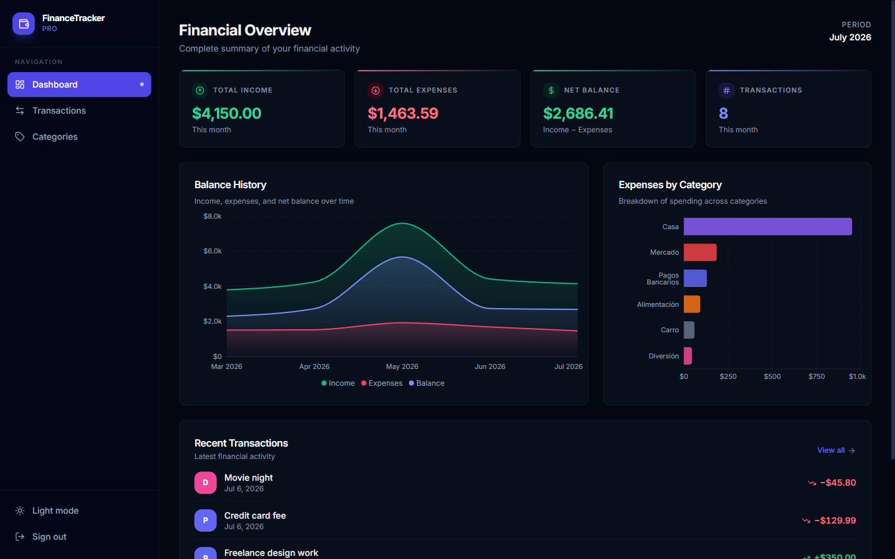
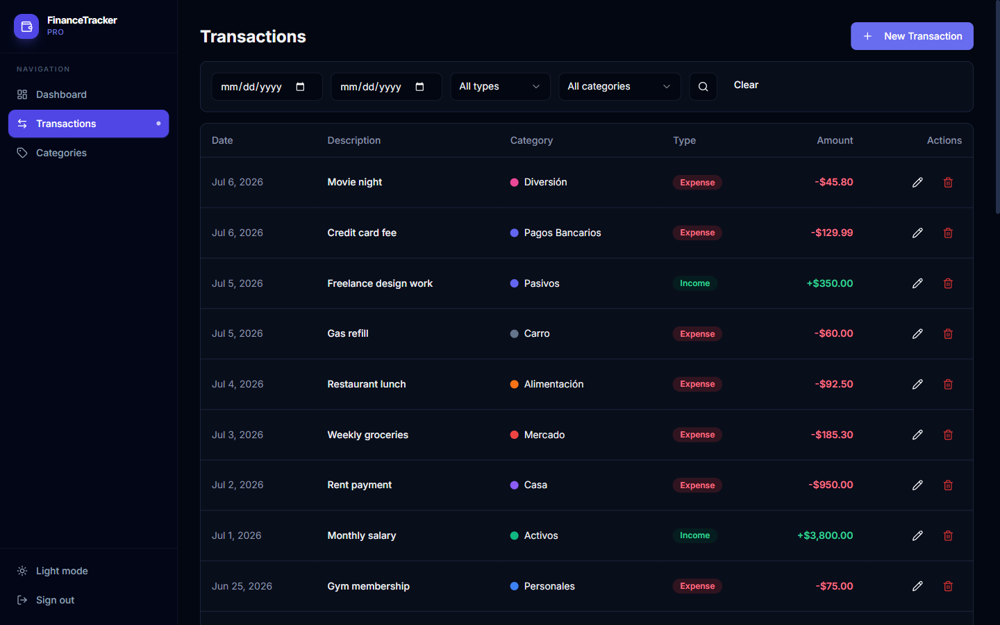
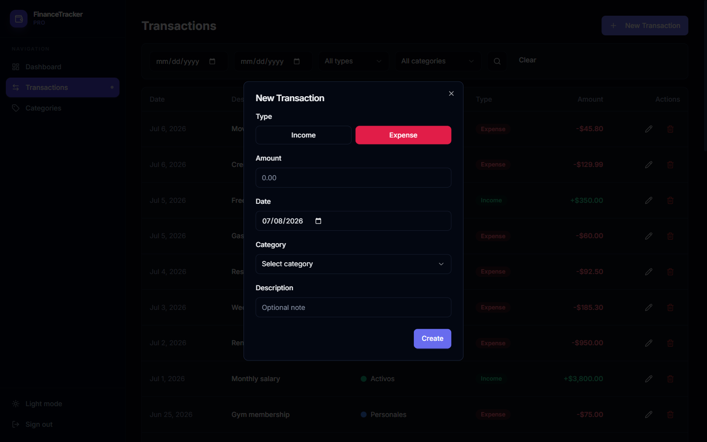
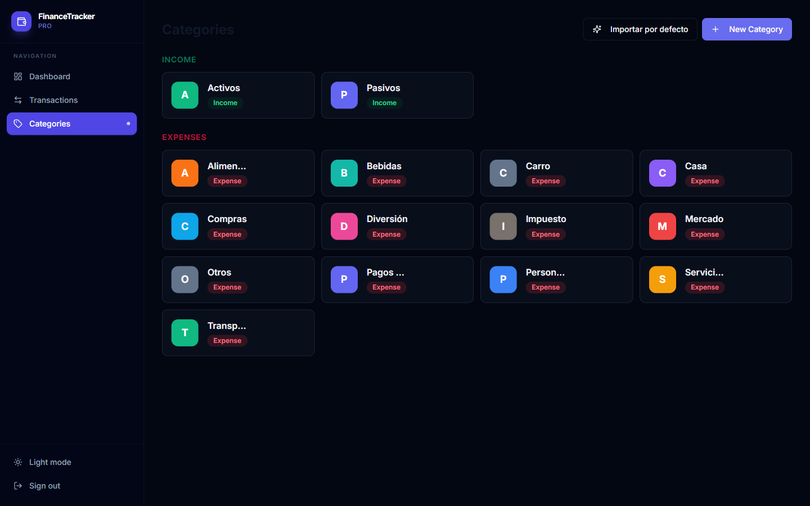

# 💰 Finance Tracker

> 🇬🇧 Prefer English? Check out the **[English README](README.md)**.

Aplicación full-stack de finanzas personales para el seguimiento de ingresos y gastos por categoría, con un panel de analíticas interactivo, autenticación JWT mediante cookies HttpOnly y un entorno de desarrollo completamente dockerizado.

**Frontend:** Next.js 14 (App Router) · React 18 · Tailwind CSS · Tremor · Shadcn UI
**Backend:** Python 3.12 · FastAPI · SQLAlchemy 2.0 (async) · Alembic · Pydantic v2
**Base de datos:** PostgreSQL 16 · **Infraestructura:** Docker Compose

---

## 📸 Capturas de pantalla

### Dashboard — Resumen financiero
Tarjetas KPI interactivas (ingresos, gastos, balance neto, número de transacciones), gráfico de área con el balance histórico y gráfico de barras de gastos por categoría construidos con Tremor.



### Transacciones
Gestión completa de transacciones con filtros por rango de fechas, tipo y categoría, además de acciones de edición y eliminación en línea.



### Nueva transacción
Crea registros de ingresos o gastos con importe, fecha, categoría y notas opcionales mediante un formulario modal validado (React Hook Form + Zod).



### Categorías
Organiza tus finanzas con categorías personalizadas de ingresos y gastos, incluyendo la carga de categorías predeterminadas con un solo clic.



---

## ✨ Funcionalidades

- **Panel de analíticas interactivo** — KPIs mensuales, balance histórico (AreaChart), gastos por categoría (BarChart) y actividad reciente.
- **Gestión de transacciones** — crear, editar, eliminar y filtrar transacciones por rango de fechas, tipo (ingreso/gasto) y categoría.
- **Categorías personalizadas** — categorías de ingresos y gastos por usuario, con un endpoint para cargar valores predeterminados.
- **Autenticación segura** — flujo OAuth2 con contraseña y JWTs almacenados estrictamente en cookies `HttpOnly` (nunca en `localStorage`), como protección contra XSS.
- **Modo oscuro / claro** — selector de tema con `next-themes`.
- **Tipado estricto de extremo a extremo** — esquemas Pydantic v2 en el backend, TypeScript + validación con Zod en el frontend.
- **Hot reload en todo el stack** — las carpetas de código fuente están montadas como volúmenes en los contenedores para obtener feedback instantáneo.

## 🏗️ Arquitectura

```
┌─────────────────┐       ┌──────────────────┐       ┌────────────────┐
│   Next.js 14     │ HTTP  │    FastAPI       │ async │  PostgreSQL 16 │
│   (App Router)   │ ────▶ │  (SQLAlchemy 2)  │ ────▶ │                │
│   Server Comps   │ :8000 │   Pydantic v2    │ :5432 │                │
└─────────────────┘       └──────────────────┘       └────────────────┘
      :3000                    Migraciones Alembic
```

- El **frontend** sigue una **estructura orientada a features**: el enrutamiento vive en `src/app/`, mientras que la lógica de dominio, componentes y hooks viven en `src/features/<dominio>/` exportados mediante barrel files. Los datos se obtienen en **Server Components** y se pasan serializados a los componentes cliente de Tremor.
- El **backend** usa un layout `src/` modular y orientado al dominio: `api/` (routers), `core/` (configuración, seguridad, base de datos), `models/` (SQLAlchemy), `schemas/` (Pydantic) y `services/` (lógica de negocio y coordinación de transacciones).

### Estructura del proyecto

```
.
├── backend/
│   ├── alembic/                 # Migraciones de base de datos
│   └── src/
│       ├── api/v1/              # Routers: auth, categories, transactions, analytics
│       ├── core/                # Configuración, motor de BD, seguridad (JWT)
│       ├── models/              # Modelos declarativos de SQLAlchemy
│       ├── schemas/             # Esquemas Pydantic v2
│       └── services/            # Capa de lógica de negocio
├── frontend/
│   └── src/
│       ├── app/                 # Next.js App Router (solo enrutamiento)
│       │   ├── (auth)/          # /login, /register
│       │   └── (dashboard)/     # /, /transactions, /categories
│       ├── components/ui/       # Primitivas de Shadcn UI
│       ├── features/            # auth, dashboard, transactions, categories
│       └── lib/                 # Cliente API, utilidades
└── docker-compose.yml
```

## 🚀 Puesta en marcha

### Requisitos previos

- [Docker](https://docs.docker.com/get-docker/) y Docker Compose

### Instalación

1. **Clonar el repositorio**

   ```bash
   git clone https://github.com/faiber1986/Finance-Tracker.git
   cd Finance-Tracker
   ```

2. **Configurar las variables de entorno**

   ```bash
   cp .env.example .env
   # Edita .env y define tu propio POSTGRES_PASSWORD y SECRET_KEY
   ```

3. **Construir y levantar el stack**

   ```bash
   docker compose up --build
   ```

4. **Aplicar las migraciones de base de datos**

   ```bash
   docker compose exec backend alembic upgrade head
   ```

5. Abrir la aplicación:

   | Servicio            | URL                            |
   | ------------------- | ------------------------------ |
   | Frontend            | http://localhost:3000          |
   | API                 | http://localhost:8000          |
   | Docs API (Swagger)  | http://localhost:8000/docs     |

   ¡Regístrate en http://localhost:3000/register y empieza a llevar tus cuentas!

### Comandos útiles

```bash
# Ejecutar los tests del backend
docker compose exec backend pytest -v

# Generar una nueva migración
docker compose exec backend alembic revision --autogenerate -m "descripción"

# Aplicar migraciones
docker compose exec backend alembic upgrade head
```

## 🔌 Resumen de la API

Todos los endpoints llevan el prefijo `/api/v1`. Las rutas autenticadas leen el JWT desde la cookie `HttpOnly`.

| Método | Endpoint | Descripción |
| ------ | -------- | ----------- |
| `POST` | `/auth/register` | Crear una cuenta nueva |
| `POST` | `/auth/login` | Iniciar sesión (establece la cookie HttpOnly) |
| `POST` | `/auth/logout` | Cerrar sesión (elimina la cookie) |
| `GET`  | `/auth/me` | Perfil del usuario actual |
| `GET/POST` | `/categories` | Listar / crear categorías |
| `GET/PUT/DELETE` | `/categories/{id}` | Obtener / actualizar / eliminar una categoría |
| `POST` | `/categories/seed-defaults` | Cargar categorías predeterminadas |
| `GET/POST` | `/transactions` | Listar (con filtros y paginación) / crear |
| `GET/PUT/DELETE` | `/transactions/{id}` | Obtener / actualizar / eliminar una transacción |
| `GET`  | `/analytics/summary` | Ingresos, gastos, balance neto y conteo |
| `GET`  | `/analytics/balance-history` | Serie histórica del balance |
| `GET`  | `/analytics/expenses-by-category` | Totales de gasto por categoría |
| `GET`  | `/analytics/income-vs-expenses` | Comparativa mensual de ingresos vs. gastos |

La documentación interactiva está disponible en **http://localhost:8000/docs** (Swagger UI).

## 🔐 Notas de seguridad

- Los JWTs se emiten mediante un flujo OAuth2 con contraseña y se almacenan **únicamente** en cookies `HttpOnly` y `Secure` — nunca en `localStorage`.
- Las contraseñas se cifran con **bcrypt** (`passlib`).
- CORS está restringido al origen configurado del frontend.

## 📄 Licencia

Este proyecto es de uso personal / educativo.
